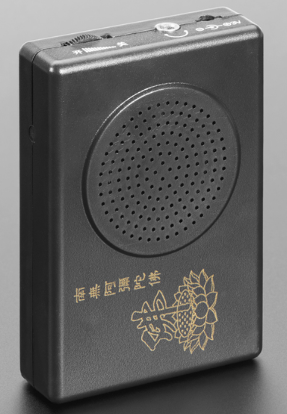
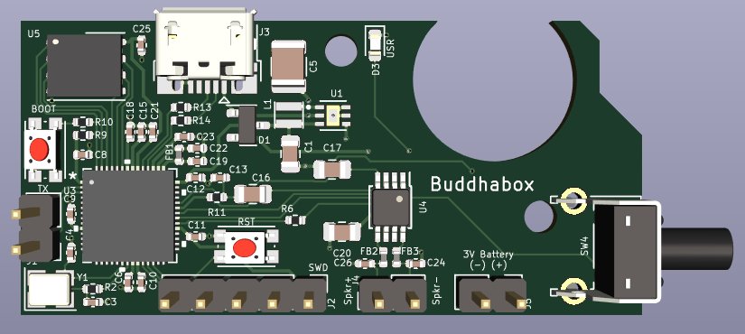

# buddhabox

A battery-powered RP2040-based audio noisemaker built into an inexpensive and readily-available portable case.

## What is it?

I came across these inexpensive Buddhist prayer chanting boxes after learning about the [Buddha Machine]([FM3 - Wikipedia](https://en.wikipedia.org/wiki/FM3#Buddha_Machine)) ambient loop player. The original Buddha Machines are no longer made but these prayer chanters are readily available from many sources and I immediately imagined repurposing them with customized loops. To that end, this project is a small PCB that exactly matches the original electronics with an RP2040, USB, flash memory and PWM driver, along with a single button to select which loop to play.

## Case

The case (as shown above) contains a small 4-ohm speaker, molded 2-cell AAA battery holder and slots for the power jack, 3.5mm mono headphone and power / volume thumbwheel. It is a 2-part clamshell with 4 self-tapping philips-head screws. There's a mold flashing where a button hole was filled in.

## Factory Driver Board

As originally built, the driver electronics is a small single-layer fenolic resin board with a chip-on-board (COB) "blob" IC that contains a single loop of prayer chanting which plays immediately on power-up. There is a small combined thumbwheel volume control / power switch similar to those found on old transistor radios, a barrel-type power jack and a mono 3.5mm audio jack, as well as wire connections to the speaker and battery holder. The board is held in place by two self-tapping screws and has drilled connections and mounting holes for a button to match the location of the filled hole in the case.

## Replacement Board

The new buddhabox board comprises an RP2040 MCU with micro USB connector, 4MB QSPI flash for code and sample storage, a single-channel PWM driver amp, button, LED and combined volume & power thumbwheel. The board shape matches the factory board and mounts with the same screws, but hole for the original power jack is unused, the hole for the headphone jack must be widened for the USB jack and the filled hole for the side button must be carved out. Additional buttons for reset and boot mode and connectors for serial TX/RX and SWD programming are provided on the board to facilitate development.

### Design Materials

[Schematic PDF](./doc/schematic.pdf)

[PCB at OSHPark](https://oshpark.com/shared_projects/EMfbYZtG)

[BOM](./hw/buddhabox_BOM.ods)

### Caveats

Although the board design works, there are a few "gotchas" to be aware of:

1. The circuit includes an option to power the board from the USB port which doesn't work properly - I'd assumed that the U1 battery boost regulator could regulate when driven with 5V USB power, but it doesn't regulate in that condition and merely passes the 5V straight thru to the 3.3V rail. To prevent this lift the VBUS leg of D1.

2. The back of the speaker rests immediately under the lower edge of the PCB and could short out some of the header connectors. To prevent this trim the connector leads flush with the back of the board and insulate the back of the speaker with tape.

3. The power/volume thumbwheel is a bit hard to find. I bought mine here: [Radio Volume Controls at AliExpress](https://www.aliexpress.us/item/3256801655864095.html)

## Firmware

The included firmware provides a IRQ-driven 11kSPS 8-bit PWM output that can be driven with loops of audio or synthesized sources selected sequentially by pressing the external button. As initially configured there are four loops derived from various musical cuts, followed by several tone and noise generators. Code can be loaded via SWD or USB, but in either approach the case must be opened to access the boot button and/or SWD connections.

## Going Further

Future revisions of the board design should address the items mentioned in "Caveats" above. It might also be interesting to replace the PWM output with an I2S speaker driver for "higher fidelity".

Firmware could be augmented to automatically detect when USB is attached and allow downloading new loops without fully reloading the entire code base.